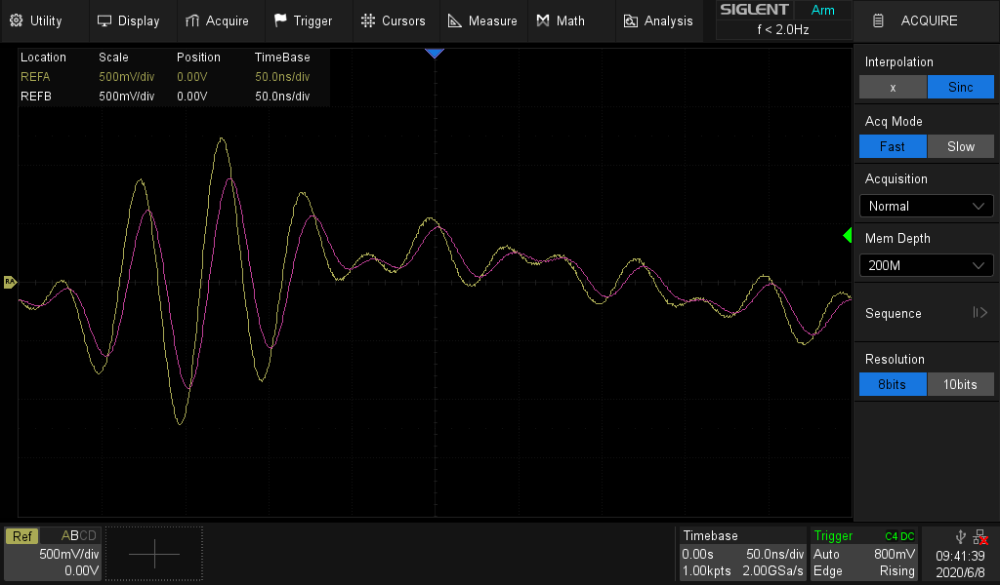
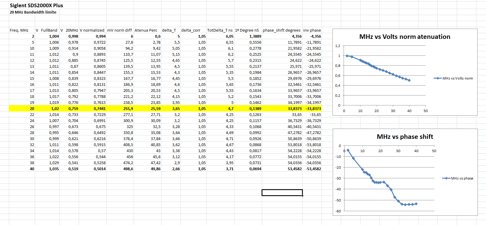
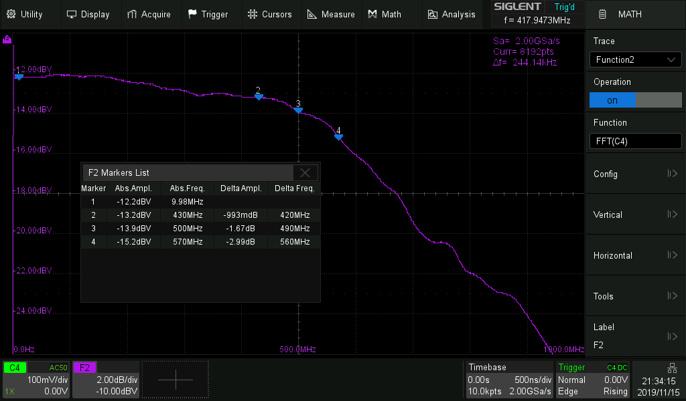
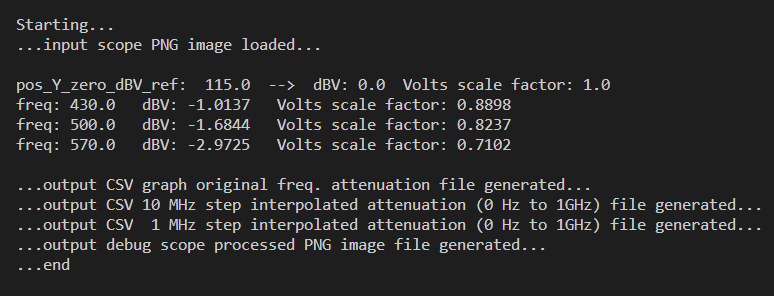
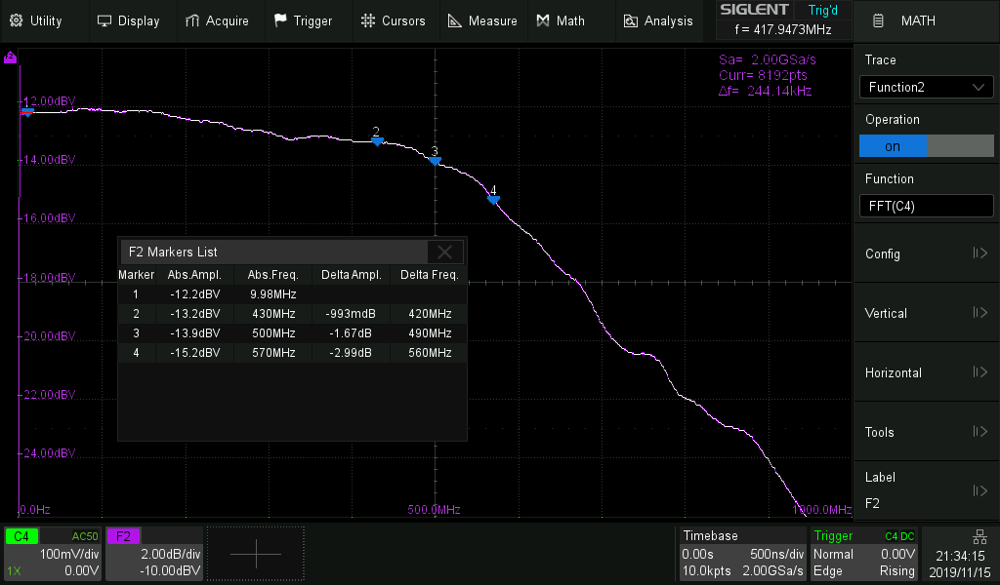

# Oscilloscope frequency response correction program

This is a program that tries to make "normal scopes", give a more accurate and more real representation of the actual signals. 

## Description

This is a project to correct (equalize) the scope frequency response of "many scopes" in a PC program that is connected to the scope by USB or LAN.  
When it is done (this project is on going), it will make a frequency domain equalization that will correct the scopes model specific frequency response. The amplitude attenuation and the phase-shift at each frequency that the input signal is composed. Limited by the scope characteristics. Then it will reconstruct the time domain signal so that it can be visualized, analyzed and uploaded to the scope REF_A channel, for direct comparison with other signals.  
This is nothing new, a similar equalization is made in the MIMO WiFi Routers and 5G mobile phones to reverse the effects of multi-path. One of it's implementation is called SC-FME (Single Carrier - Frequency Domain Equalization).

## Please see this project **EEVBlog thread** where many of the concepts that will be used are heavily detailed with history  

I put it under **Test Equipment**. 
Topic: **Oscilloscope frequency response correction program**  
[https://www.eevblog.com/forum/testgear/oscilloscope-frequency-response-correction-program/](https://www.eevblog.com/forum/testgear/oscilloscope-frequency-response-correction-program/)  

## What is the problem that I am trying to solve?

When you see a signal on the scope, that it is made with components with frequêncies of up to 10 % or 20 % of the bandwidth of the scope, the signal will be correctly represented on the scope screen.  
 
But if the signal, although appearing to be a low frequency signal, has some high frequency components in it along the lower frequency components, all it's components will be summed up and generate the final shape of the signal. But those high frequency components will suffer more with two forms of distortion. They will have a lower amplitude (lower volts, greater attenuation) and they will have a greater phase-shift (in time. That means that they will take more time to arrive at the scopes ADC while running along the signal path, that in relation to the lower frequency signal components).     
 
Because all those sinusoids are summed up at the same time instant, when the ADC takes a sample, "a photograph in as instant", if some of them have there peaks and lower parts of the wave with different amplitudes for different frequencies (**different attenuations by frequency**) and **if their peaks and lower parts of the wave are not synchronized in time**, the final signal that you will see **will not be a very accurate representation of the real signal** that you are trying to measure at the tip of the scope probe or the tip of the coaxial cable.   
 
To see this problem in action see the following thread image test or experiment that I demonstrate in the post of the EEVBlog thread that I created for this project.   
 
The same signal is compared in the same oscilloscope, when the frequencies if their components are much lower then the bandwidth of the scope and when they are high when compared to the bandwidth of the scope. To make this test I used the fact that the scope can save a wave form in channel REF_A and that and that the oscilloscope as an option to lower it's bandwidth.  
 
Experiment that illustrates the problem. 
  
 
[Experiment in EEVBlog post](https://www.eevblog.com/forum/testgear/oscilloscope-frequency-response-correction-program/msg3095744/#msg3095744)  
 
The program tries to make this equalization or correction and invert or reverse the effect of attenuation in amplitude and phase-shift at each of the signal frequencies.  
 
This idea can be applied to any scope and this project will try to support some scopes.

## Components that influence a scope frequency response because they are on the signal path

- Scope probe frequency response or connected coaxial cable frequency response.
- Input impedance selected (1 M Ohm or 50 Ohms)
- Scope low noise amplifier frequency response in the front end.
- Anti-aliasing filter before the input of the sampling ADC.
- ADC (Analog to Digital Converter) sampling rate and general characteristics.
 
All those factors contribute to the frequency response of a scope. But they can be measured (characterized), and inverted or reversed by applying **FDE - Frequency Domain Equalization**.  
See the **this project EEVBlog thread** for methods of characterizing the amplitude and the phase-shift for each frequency. That is characterizing the frequency response of the scope.

## Steps needed

1. For a given model, get the scope frequency response characterization from 0 Hz to half the ADC sampling frequency. This in terms of amplitude attenuation and phase-shift characterization at each frequency. Ideally a frequency sweep, but can also be in steps.
2. Automate the frequency response characterization (this is optional, but a really good idea for fast characterization of different probes, or coaxial cables, this can also be made by the community and the info used as simple data file for the program). 
3. The program connects to the scope via PyVisa open source library.
4. The processing will be ...
   1. Read the buffer from the scope by USB or LAN.
   2. Do an FFT(signal), Fast Fourier Transform on the signal and transform it from the time domain (voltage amplitude vs time) into the frequency domain (amplitude vs frequency and phase-shift vs frequency).
   3. In the frequency domain, apply to each frequency apply the inverse of the attenuation and phase-shift at each frequency and correct or equalize the signal. Note that this is not as simple as it locks. Mainly, because of FFT inter centered bin frequency components of the signal (give raise to inter bin leakage) and because of the fact that the use of pré-processing windows, would alter the quality of the signal reconstruction. In the frequency domain the use of machine learning to learn a general mapping of frequency equalization from fine grained characterization, could also be used. 
   4. Then, do an iFFT( ), inverse Fast Fourier Transform on the frequency domain representation of the signal and reconstruct the original signal in the time domain. But more accurately, more close to the real signal.
   5. Show it on the PC in a graph plot, so you can analyze it.
5. Send it to the scope REF_A channel for comparison with other signals, if you want. 

## Oscilloscopes targeted

In principal the same method could be applied to any scope brand or model. The only thing that should change would be the scope frequency response characterization profile and the specific way the program connects to the scope. But PyVisa supports many brands and different models, by USB and by LAN. 

### **A** - Siglent SDS2104-Plus 100 MHz - equalization from 0 Hz up to 945 MHz 

This is the first scope model that I will be targeting with the software. It is a 100 MHz Siglent SDS2104-Plus with 2 ADC's, each with 2 Gig sample / sec. Having a resolution of 8 bits. This model can have a small hack that gives puts the -3dB attenuation mark on the 570 MHz (bandwidth). It's frontend, allows this scope to be used to analyse signals of up to 945 MHz. But with great attenuation. If the signal frequency components are only amplitude attenuated and phase-shifted at each frequency, that effects, in principal can be corrected or reversed. This is a normal scope effect, but if corrected (frequency domain equalized), the signal can be reconstructed with more fidelity up to it's frontend max limit of of 945 MHz. Each of the 2 ADC's are shared by each pair of 2 channels, totalizing 4 channels. If you use only one channel from the first pair (channel 1 or channel 2), and one channel from the second pair (channel 3 or channel 4), you will have the maximum possible frequency on two channels simultaneously.

### **B** - Rigol DS1104Z 100 MHz - equalization from 0 Hz maybe up to 300 MHz or 400 MHz

This will be the second scope that I will target with this program.
This scope as a bandwidth of 100 MHz at -3dB attenuation but in principal, it can be used to analyze signal of up to 300 MHz or 400 MHz. But they will be heavily attenuated and phase-shifted. The some program, with a different scope profile characterization, in principal will also correct this effect. This scope as a one 8 bit ADC at 1 Gig sample / second that is shared among all 4 channels. 

### **C** - Siglent SDS1104X-E 100 MHz - equalization from 0 Hz maybe to 300 MHz or 400 MHz

There is the possibly that this is the third scope that I will be targeting with this program. This scope as two 8 bit ADC of 1 Gig sample / second used for each of the 2 pairs of channels, totalizing 4 channels. 

### **D** - Other possible scopes targeted by the program directly by me

- Rigol DS1052E 50 MHz
- Hantek 100 MHz 

# Current progress....

## **A** - Siglent SDS2104-Plus .... current progress

This code is under the directory.  
[Siglent_SDS2104_Plus directory](./Siglent_SDS2104_Plus/)  

### **A1** - Measured data of the scope for 8 bit vs 10 bit mode from 0 Hz to 120 MHz

This 10 bit mode as a big attenuation up until the -3dB mark, it's not a very flat curve. This was the main motivation to start this project.  
 
So I took the following measurements of **1 Vpp** at **8 bits** and at **10 bits**:  
**10MHz**  8: 1.027V – 10: 1.0067V -> delta:  **20.3mV**  
20MHz   8: 1.027V – 10: 1.000V -> delta:  27mV  
30MHz  8: 1.031V – 10: 990mV -> delta:  41mV  
40MHz  8: 1.033V – 10: 974mV -> delta:  59mV  
**50MHz** 8: 1.030V – 10: 948mV -> delta:  **82mV**  
60MHz  8: 1.031V – 10: 921mV -> delta:  110mV  
70MHz  8: 1.032V – 10: 889mV -> delta:  143mV  
80MHz  8: 1.028V – 10: 850mV -> delta:  178mV  
90MHz  8: 1.029V – 10: 812mV -> delta:  217mV  
**100MHz**  8: 1.025V – 10: 770mV -> delta: **255mV**  
110MHz  8: 1.032V – 10: 732mV -> delta:  300mV  
120MHz  8: 1.030V – 10: 677mV  -> delta:  353mV  

### **A2** - Measured data for 20 MHz bandwidth limit 8 bit mode from 0 Hz to 40 MHz

Data points png with graphs of attenuation and phase-shift.  
  
 
The excel file is: 
[Attenuation excel file](./Siglent_SDS2104_Plus/Data_collected/Osciloscope_20MHz_bandwidth_limit_v04.xlsx)  

### **A3** - Program that extracts the attenuation data points of an FFT graph 

I made **a program to extract with some degree of precision the attenuation characterization data points, of an FFT graph image posted on the EEVBlog forum. It was made width a RF Signal Generator from 0 Hz to 1 GHz.** I generated a CSV with the directly obtained data points. I also used an interpolation algorithm to generate, the in between points in **dBV** and calculate the **Volts scale factor** for each frequency. I Generated a CSV from 0 Hz to 1 GHz in 10 MHz and 1 MHz steps. The validation, that the data was extracted correctly came from the 4 data points that are in the image and they had a **very small error, for example the 570 MHz in the image, as numerical value written -2.99dB and the point interpolated as a value of -2.9725 dB.** Note that this point nor it's neighbors aren't even directly accessible from the FFT plot, because the markers are large in with and they are in front, so this points had to be interpolated.   
 
See in the EEVBlog forum, the EEVBlog thread for this project **Oscilloscope frequency response correction program** in the beginning of this document.   
 
Following is the validation ...  
**Input image:** "SDS2354Xplus_2GSa_8bit_1GHz.png"  
**Source of image:** The post on EEVBlog Forum from the member **Performa01** on the topic "Siglent SDS2000X Plus coming", inside the area "Test Equipment". 
[Performa01 post](https://www.eevblog.com/forum/testgear/siglent-sds2000x-plus-coming/msg2787168/#msg2787168)  
 
The FFT input image that we will extract the data.  
 
 
Data interpolated from the extracted FFT input image.  
  
 
FFT output image with extracted data points supper imposed. Note: When there were more then one vertical plot data pixel I average the position to the vertical middle of the blob. 
  
 
This program **code** is in [Siglent_SDS2104_Plus directory](./Siglent_SDS2104_Plus/Extract_attenuation_values_from_scope_FFT_image/)  
 
The **main program file** is [extract_attenuation_values_from_scope_fft_image.py](./Siglent_SDS2104_Plus/Extract_attenuation_values_from_scope_FFT_image/extract_attenuation_values_from_scope_fft_image.py)  
 
The CSV data files extracted are:  
[dbVAttenuationTable_OriginalFreq_0_to_1_GHz.csv](./Siglent_SDS2104_Plus/Extract_attenuation_values_from_scope_FFT_image/output_out/dbVAttenuationTable_OriginalFreq_0_to_1_GHz.csv)  
[dbVAttenuationTable_interpol_10M_step_0_to_1_GHz.csv](./Siglent_SDS2104_Plus/Extract_attenuation_values_from_scope_FFT_image/output_out/dbVAttenuationTable_interpol_10M_step_0_to_1_GHz.csv)  
[dbVAttenuationTable_interpol_1M_step_0_to_1_GHz.csv](./Siglent_SDS2104_Plus//Extract_attenuation_values_from_scope_FFT_image/output_out/dbVAttenuationTable_interpol_1M_step_0_to_1_GHz.csv)  

## **B** - Rigol DS1104Z .... current progress

This code is under the directory.  
[Rigol_DS1104Z directory](./Rigol_DS1104Z/)  
 
1. ....

2. ....

## Recommended reading books and videos and bibliography

**The central component of this project** is the complex equalization of the input signal converted from the time domain to the frequency domain.  What I said that will make the correction or the process of revert the natural effect of distortion in the scope path on the signal and try to obtain a more real representation of the original signal.  
 
To do this you need **the “powers” of the FFT** – Fast Fourier Transform.
I would like to give here some links and info so that all can follow the concepts for this project journey as it is being made.  
 
Note: **I know that the majority of you know much more about Systems and Signals, about DSP – Digital Signal Processing, about Control Theory that I could even dream off knowing.** But for the ones that know less than me or for the ones that want to refresh their knowledge, I have put here what I think are nice pointers and nice sources of info about FFT and DSP in general.  
 
**Start with this nice video about FFT**.  
Discrete Fourier Transform - Simple Step by Step  
[https://www.youtube.com/watch?v=mkGsMWi_j4Q](https://www.youtube.com/watch?v=mkGsMWi_j4Q)  
 
Then see the following video from **3Blue1Brown**:  
But what is the Fourier Transform? A visual introduction.  
[https://www.youtube.com/watch?v=spUNpyF58BY](https://www.youtube.com/watch?v=spUNpyF58BY)  
 
Then see the following youtube **play list** about the FFT Transform, there are really good videos on here, they are well worth your time.  
[https://www.youtube.com/playlist?list=PL7HEDXv3wHPNCKVActVkD-OL1C7deqHGC](https://www.youtube.com/playlist?list=PL7HEDXv3wHPNCKVActVkD-OL1C7deqHGC)  
 
And **if you want to go deeper** see the following **Fourier Analysis** 36 videos list from Steve Brunton.  
[https://www.youtube.com/watch?v=jNC0jxb0OxE&list=PLMrJAkhIeNNT_Xh3Oy0Y4LTj0Oxo8GqsC](https://www.youtube.com/watch?v=jNC0jxb0OxE&list=PLMrJAkhIeNNT_Xh3Oy0Y4LTj0Oxo8GqsC)  
 
Then **hit the books** …… there are three books that **I highly recommend**, specially the first one, and they are all well worth reading:

1. **Understanding Digital Signal Processing 3rd Edition**  
   by Richard G. Lyons

2. **Digital Signal Processing in Modern Communication Systems**  
   by Andreas Schwarzinger

3. **The Fast Fourier Transform FFT and its applications**  
   By E. Oran Brigham

And there are five **free DSP book authors** and they also cover the FFT very well:
 

1. **The Scientist & Engineer's Guide to Digital Signal Processing**  
   by Steven W. Smith  
   [http://www.dspguide.com/](http://www.dspguide.com/)

2. **Introduction to Signal Processing**  
   by Sophocles J. Orfanidis  
   [https://www.ece.rutgers.edu/~orfanidi/intro2sp/](https://www.ece.rutgers.edu/~orfanidi/intro2sp/)

3. **Mathematics of the discrete Fourier transform (DFT) with audio applications**, Second edition  
   by Julius O. Smith III  
   [https://ccrma.stanford.edu/~jos/mdft/](https://ccrma.stanford.edu/~jos/mdft/)

4. **Introduction to digital filters with audio applications**  
   by Julius O. Smith III  
   [https://ccrma.stanford.edu/~jos/filters/](https://ccrma.stanford.edu/~jos/filters/)

5. **Spectral audio signal processing**  
   by Julius O. Smith III  
   [https://ccrma.stanford.edu/~jos/sasp/](https://ccrma.stanford.edu/~jos/sasp/)

Note: The **last three should be read by the order** they are listed.

## License
MIT Open Source license.

## Have fun!
Best regards,  
Joao Nuno Carvalho  